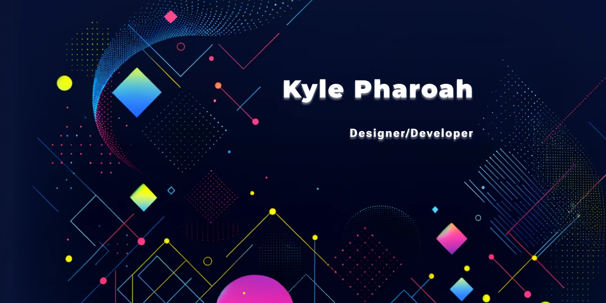

**`Designer/Developer`**

As a full-stack developer, I've honed my skills to tackle both the front and back ends of web applications with precision and creativity. I have a particular passion for Angular, which has empowered me to craft dynamic and responsive user interfaces that bring client-side experiences to life. My journey in tech is driven by my enthusiasm for building seamless, end-to-end solutions that push the boundaries of user engagement and performance.

### Stats

### 2023 projects

### Skills
- **Languages**: JavaScript, TypeScript, HTML5, CSS3, Python, C#, PHP, Kotlin
- **Frameworks/Libraries**: Angular, React, Node.js, .NET, React Native, Symfony
- **Databases**: MongoDB, SQL, Firestore
- **Tools**: Git, Docker

### Contact
* pharoahkyle@gmail.com

<!--  -->
<!-- 

 -->
